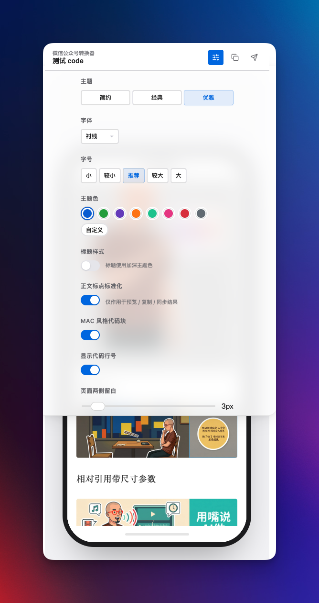
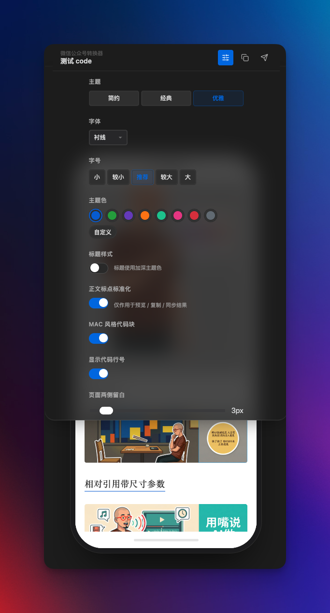

[English](./README.md) | [简体中文](./README.zh-CN.md)

# Wechat Converter for Obsidian

Convert Obsidian Markdown into polished WeChat articles with live preview, copy-to-editor, and optional draft sync.

This plugin is built for writers who publish from Obsidian to WeChat Official Accounts. It focuses on the last mile of publishing: preserving layout, code blocks, math, images, and article metadata while keeping the workflow fast inside Obsidian.

> This project is deeply refactored from [ai-writing-plugins](https://github.com/Ceeon/ai-writing-plugins). Proper attribution is retained in this repository.

## Highlights

- Live article preview with fast side-by-side rendering.
- Copy rich HTML directly into the WeChat editor.
- Sync articles to the WeChat draft box with multi-account support.
- Math rendering with SVG output for better WeChat compatibility.
- Local image handling for wiki links, relative paths, absolute paths, and GIFs.
- Visual settings panel with theme, typography, preview, and code block controls.
- Experimental AI layout planning with provider-based configuration, schema checks, and debug snapshots.
- Chinese punctuation normalization for rendered output, with protection for code and technical tokens.

  
  

## Installation

### Manual install

1. Download the latest release from [GitHub Releases](https://github.com/DavidLam-oss/obsidian-wechat-converter/releases).
2. Extract the plugin into your vault under `.obsidian/plugins/obsidian-wechat-converter/`.
3. Make sure the folder contains:
   - `main.js`
   - `manifest.json`
   - `styles.css`
4. Reload Obsidian and enable the plugin.

### BRAT

1. Install and enable BRAT.
2. Add the repository `DavidLam-oss/obsidian-wechat-converter`.
3. After installation, do a quick smoke test:
   - Open the converter panel
   - Check preview rendering
   - Copy once to WeChat
   - Optionally test draft sync

## Usage

1. Open the plugin from the left ribbon icon or the command palette with `Open Wechat Converter`.
2. Edit your Markdown note as usual. The right panel updates the article preview in real time.
3. Click `Copy to WeChat` to paste rich HTML into the WeChat editor.
4. Optionally click `Sync to Draft` after configuring your WeChat AppID and AppSecret in plugin settings.

### Experimental AI layout planning

- Configure AI providers from the plugin settings page.
- Open `AI 编排` from the converter toolbar to generate layout suggestions for the current article.
- Review schema warnings, inspect layout JSON, or copy a debug prompt snapshot before applying the result to preview.

### Draft sync

- Supports up to 5 WeChat Official Account profiles.
- Uses `cover` and `excerpt` from frontmatter when available.
- Falls back to the first body image and auto-generated excerpt when not provided.
- Can optionally clean up a configured output directory after a successful sync.

### Chinese punctuation normalization

The right-side settings panel includes `正文标点标准化`.

- Scope: preview, copy result, and draft sync output only.
- Does not modify the original Markdown file.
- Converts common ASCII punctuation into Chinese punctuation in Chinese writing context.
- Protects inline code, fenced code blocks, URLs, emails, file paths, CLI tokens, environment variables, math-like expressions, and other technical tokens.

### Cloudflare proxy

If WeChat API IP allowlisting is a problem in your network, you can use a Cloudflare Worker proxy. Detailed deployment steps and worker code are available in the Chinese guide:

- [Proxy setup in Chinese](./README.zh-CN.md#-代理设置解决-ip-白名单问题)

## Screenshots

  
  

## Who this is for

- Obsidian users publishing to WeChat Official Accounts
- Technical writers who need code, math, and image fidelity
- Chinese-language creators who want a faster publishing workflow

## More docs

- Chinese documentation: [README.zh-CN.md](./README.zh-CN.md)
- Release notes: [RELEASE_NOTES](./RELEASE_NOTES/)

## License

MIT
